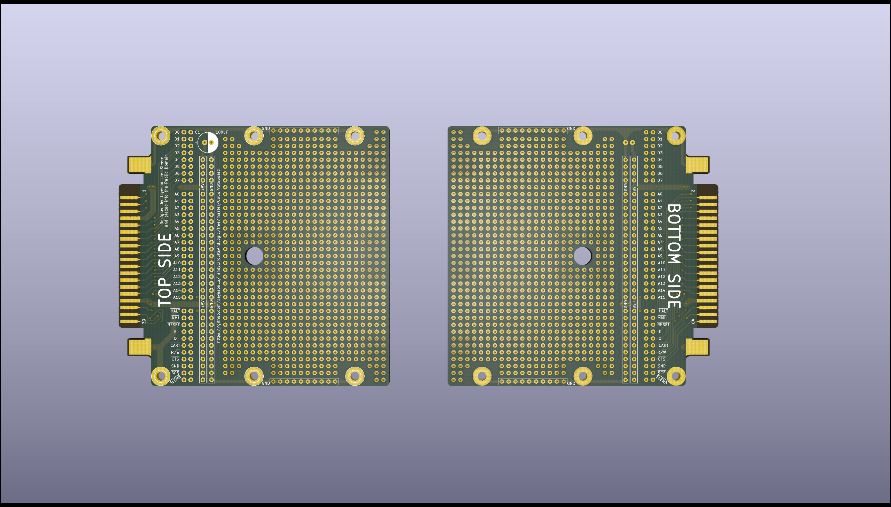

CoCo Prototyping Board
======================

This is a basic prototyping board for the Color Computer cartridge port.

Everything has been entered into the public domain so feel free to make them, 
sell them, modify the design, or use the board outline in your own CoCo
designs.

The board has been sized to the 100mm x 100mm size that is the limit for very
low cost board production at some PCB vendors. For prototyping purposes, the
lead free HASL finish will typically leave you with very nicely tinned fingers
on the edge connector. An ENIG finish is not recommended - the gold plate is
extremely thin and will wear off very quickly. Hard gold plated fingers is 
fine, however likely overkill for prototypes.

Gerbers are provided in the Gerbers folder.

